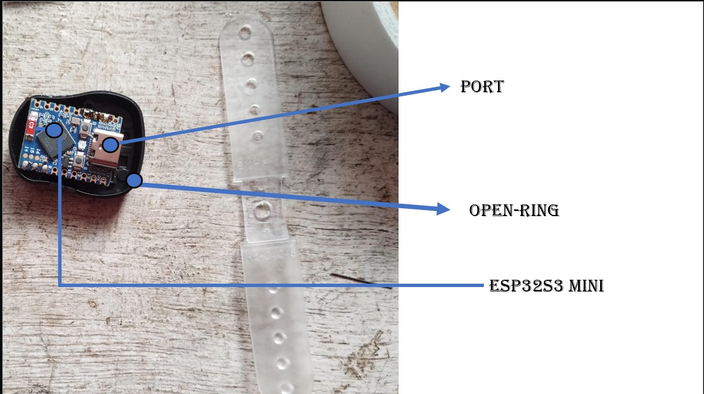

# Open Ring 

**Figure 1**

open Ring overview image  

## Minimum System Requirements

- **Operating System:** Windows 11 (64-bit)
- **Memory (RAM):** 8 GB
- **Bluetooth:** Latest Bluetooth driver installed

# Steps To Run

### 1. Turn Off the Device Switch 
### 2. Connect The Esp32S3 With Your PC/LAPTOP
### 3. Upload the OpenRing Code to the ESP32s3.
For uploading the Code please follow the instruction Video Below

[setup with espidf and upload Code](https://youtu.be/VlWCV5VcAak?si=eiqUj2qTMjfMweKC)

[code](/espCode/)

### 4.Disconnect the ESP32s3
### 5.Turn On the esp32s3.
### 6. Follow the Video below to collect the raw data from OPEN-RING.

[Open Ring Raw Data Collection](https://drive.google.com/file/d/1l5skFOcEXKjs__w9qkN38sToBGDwCzlI/view?usp=drivesdk)

## Find Out More:
[Readme](./readme.md)