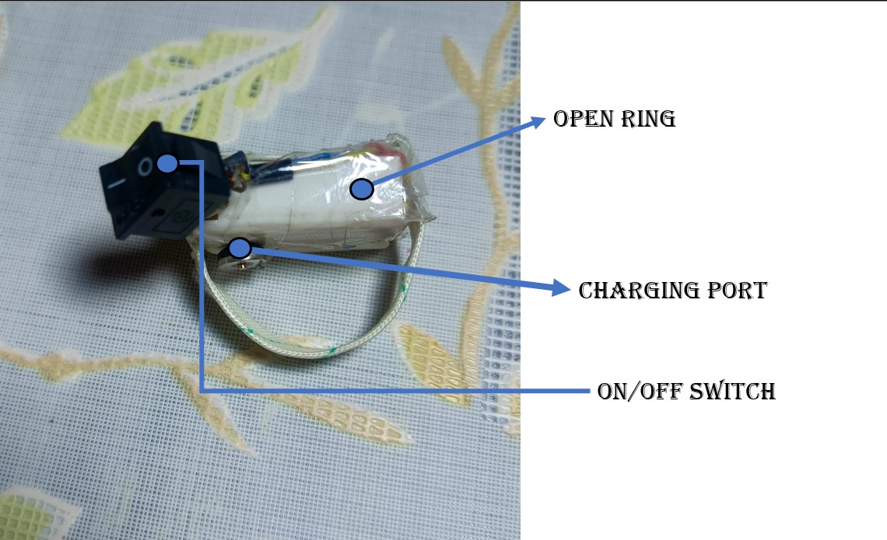

# OPEN RING

This Ring helps to detect real time human acivity gesture 

# Overview



This is the structure open ring. the switch is used to turn on and off the ring . the charging port is the magnetic port used to for charging 
! always used low watt 5v Charger.

# Components Used

[Esp32s3 Mini](https://robu.in/product/waveshare-esp32-s3-mini-development-board-based-on-esp32-s3fh4r2-dual-core-processor-240mhz-running-frequency-2-4ghz-wi-fi-bluetooth-5/)

[GY-91 IMU Sensor](https://roboticsdna.in/product/gy-91-mpu9250bmp280-10dof-acceleration-gyro-9-axis-sensor-module/?src=google&kwd=&adgroup={adgroup}&device=c&campaign={campaign}&adgroup={adgroup}&keyword=&matchtype=&gad_campaignid=23316242547)

[ON-OFF Switch](https://techdelivers.com/small-spst-mini-rocker-swich-2pin?tag=cw%20grs%202011%20switch.)


# Safe Charging Method


# Circuit Diagram


# Data 

Follow the [data](/data/) folder for collected Datas.

# ESP32S3 CODING

The majority of the embedded system code is written in the C language. For the compilation and the Flahsing we Have used the 
[espidf](docs.espressif.com). 

For The Detailed explanation watch out the videos:

[Flashing Using the ESP_IDF](https://youtu.be/VlWCV5VcAak?si=apgle1hnOAcECXP0)


# Feature Engineering & Data Visualization

## Plotting

create a mydata folder and place all the csv file with the data run the [plotter.py](/Data_Plotting/plotter.py) plot the raw data.

- Also try out the other plotting python file for the bold and interactive plotting

- for the interactive data plotting use the code below
    ```python
    import pandas as pd
    import matplotlib.pyplot as plt
    import glob
    import os

    def process_and_plot(csv_file, save_folder):
        # Load CSV
        df = pd.read_csv(csv_file)


        fig, axs = plt.subplots(2, 1, figsize=(10, 6))
        fig.suptitle(os.path.basename(csv_file))

 
        axs[0].plot(df["Accel_X"], label="Accel_X")
        axs[0].plot(df["Accel_Y"], label="Accel_Y")
        axs[0].plot(df["Accel_Z"], label="Accel_Z")
        axs[0].legend()
        axs[0].set_title("Accelerometer")

     
        axs[1].plot(df["Gyro_X"], label="Gyro_X")
        axs[1].plot(df["Gyro_Y"], label="Gyro_Y")
        axs[1].plot(df["Gyro_Z"], label="Gyro_Z")
        axs[1].legend()
        axs[1].set_title("Gyroscope")

        plt.tight_layout()

       
        out_path = os.path.join(save_folder, os.path.splitext(os.path.basename(csv_file))[0] + ".png")
        plt.savefig(out_path, dpi=300, bbox_inches="tight")
        plt.close()

        print(f"Saved plot -> {out_path}")


    def batch_plot(source_folder, dest_folder):
        os.makedirs(dest_folder, exist_ok=True)

        for file in glob.glob(os.path.join(source_folder, "*.csv")):
            process_and_plot(file, dest_folder)


    batch_plot("cleaned_data","plotting/cleaned_data")


    ```


# Embedded Machine Learning

Use m2cgen for the converting the normal ml model into the embedded ml model and flash the model in the esp32s3 for the observation


find out the following folder to understand the converting in the embedded ml model

[Embedded C model using the M2CGEN](/m2cgenmodel/modelmaker.py)


# Filtration Method

For the filtration of the raw data we haved used the Kalman-filter , high pass filter , low pass filter 

for the details find out the below links

[HIGH PASS FILTER](https://en.wikipedia.org/wiki/High-pass_filter)

[LOW PASS FILTER](https://en.wikipedia.org/wiki/Low-pass_filter)

[KALMAN FILTER](https://en.wikipedia.org/wiki/Kalman_filter)


* Find Out the Source Code from here
- [High pass filter](/featureEngineering/)
- [Low Pass Filter](/featureEngineering/)
- [Kalman Filter](/featureEngineering/kalmanFilter/kalman.c)


# Code for the gy91 sensor with espidf

- For Arduino use the following code
    
    ```cpp
    #include <Wire.h>
    #include <MPU9250.h>

    MPU9250 mpu;

    void setup() {
    Wire.begin();
    Serial.begin(115200);
    mpu.setup(0x68);
    }

    void loop() {
    if (mpu.update()) {
        Serial.print(mpu.getAccX()); Serial.print(",");
        Serial.print(mpu.getAccY()); Serial.print(",");
        Serial.print(mpu.getAccZ()); Serial.print(",");
        Serial.print(mpu.getGyroX()); Serial.print(",");
        Serial.print(mpu.getGyroY()); Serial.print(",");
        Serial.print(mpu.getGyroZ()); Serial.print(",");
        Serial.print(mpu.getMagX()); Serial.print(",");
        Serial.print(mpu.getMagY()); Serial.print(",");
        Serial.println(mpu.getMagZ());
    }
    }

    ```

- For the espidf Driver code follow this repository

    ```c
    #include "mpu9250.h"
    #include "driver/i2c.h"
    #include "esp_log.h"

    #define MPU9250_ADDR         0x68
    #define I2C_MASTER_NUM       I2C_NUM_0
    // #define I2C_MASTER_SDA_IO    21
    // #define I2C_MASTER_SCL_IO    22
    #define I2C_MASTER_FREQ_HZ   40000

    static const char *TAG = "MPU9250";

    void mpu9250_i2c_init(int sda, int scl) {
        i2c_config_t conf = {
            .mode = I2C_MODE_MASTER,
            .sda_io_num = sda,
            .scl_io_num = scl,
            .sda_pullup_en = GPIO_PULLUP_ENABLE,
            .scl_pullup_en = GPIO_PULLUP_ENABLE,
            .master.clk_speed = I2C_MASTER_FREQ_HZ,
        };
        i2c_param_config(I2C_MASTER_NUM, &conf);
        i2c_driver_install(I2C_MASTER_NUM, conf.mode, 0, 0, 0);
    }


    static esp_err_t mpu9250_write_byte(uint8_t reg, uint8_t data) {
        i2c_cmd_handle_t cmd = i2c_cmd_link_create();
        i2c_master_start(cd);
        i2c_master_write_byte(cmd, MPU9250_ADDR << 1 | I2C_MASTER_WRITE, true);
        i2c_master_write_byte(cmd, reg, true);
        i2c_master_write_byte(cmd, data, true);
        i2c_master_stop(cmd);
        esp_err_t ret = i2c_master_cmd_begin(I2C_MASTER_NUM, cmd, pdMS_TO_TICKS(10));
        i2c_cmd_link_delete(cmd);
        return ret;
    }


    static int16_t mpu9250_read_word(uint8_t reg) {
        uint8_t data[2];
        i2c_cmd_handle_t cmd = i2c_cmd_link_create();
        i2c_master_start(cmd);
        i2c_master_write_byte(cmd, MPU9250_ADDR << 1 | I2C_MASTER_WRITE, true);
        i2c_master_write_byte(cmd, reg, true);
        i2c_master_start(cmd);
        i2c_master_write_byte(cmd, MPU9250_ADDR << 1 | I2C_MASTER_READ, true);
        i2c_master_read(cmd, data, 2, I2C_MASTER_LAST_NACK);
        i2c_master_stop(cmd);
        i2c_master_cmd_begin(I2C_MASTER_NUM, cmd, pdMS_TO_TICKS(1000));
        i2c_cmd_link_delete(cmd);
        return (int16_t)((data[0] << 8) | data[1]);
    }


    void mpu9250_init(void) {
        esp_err_t ret = mpu9250_write_byte(0x6B, 0x00);  // Wake up device
        if (ret != ESP_OK) {
            ESP_LOGE(TAG, "Failed to wake up MPU9250");
        }
    }


    void mpu9250_read_all(mpu9250_data_t *data) {
        data->accel_x = mpu9250_read_word(0x3B);
        data->accel_y = mpu9250_read_word(0x3D);
        data->accel_z = mpu9250_read_word(0x3F);
        data->gyro_x  = mpu9250_read_word(0x43);
        data->gyro_y  = mpu9250_read_word(0x45);
        data->gyro_z  = mpu9250_read_word(0x47);
    }
    ```

# Model trainning

Source Code

# Find Out the Manual

[Manual](./manual.md)
